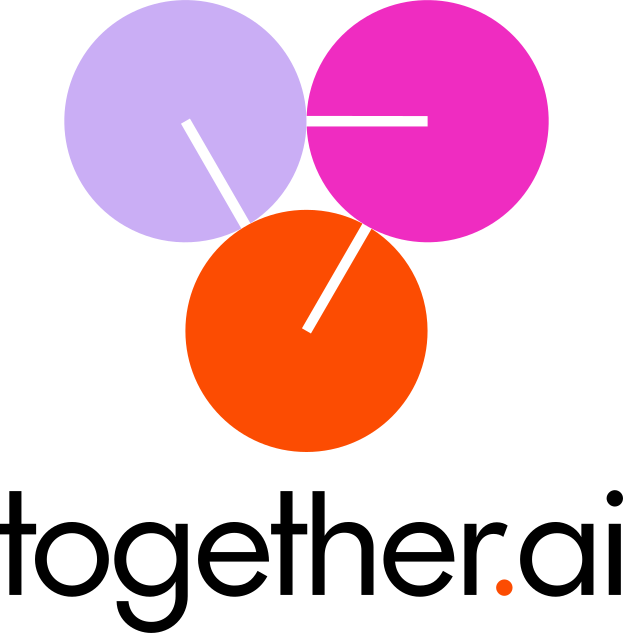
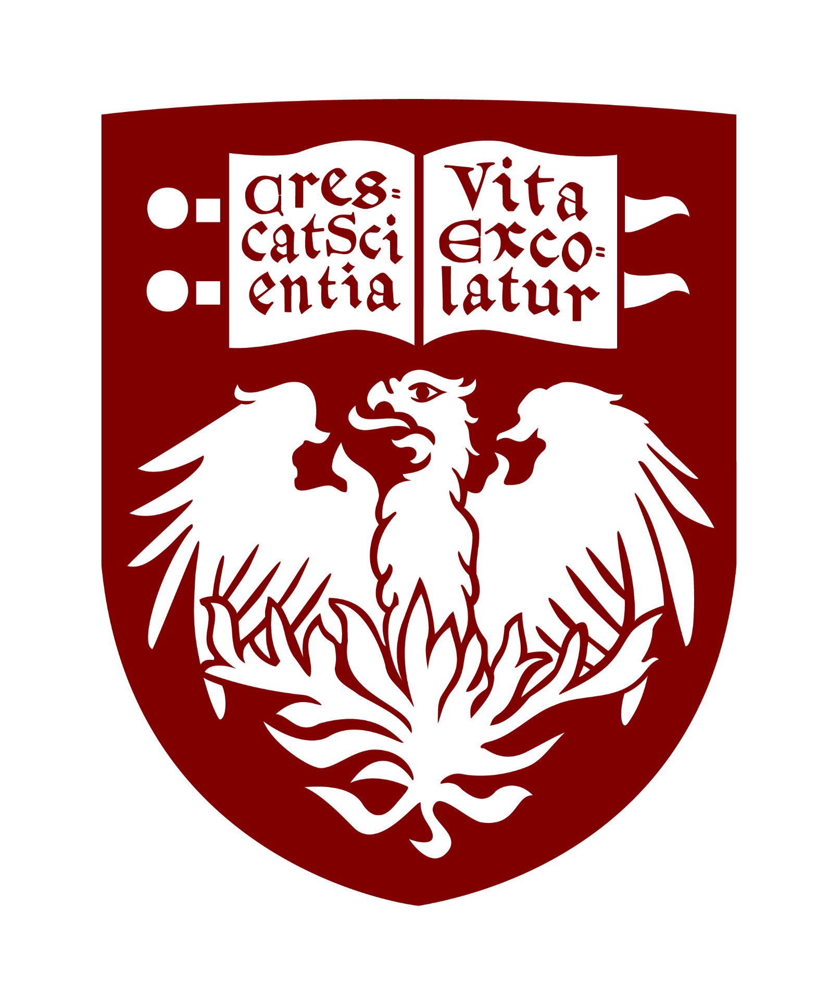
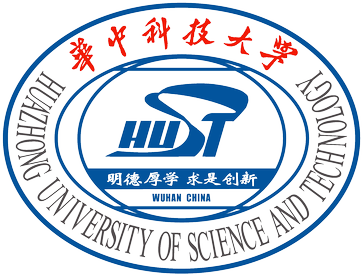

Hello! I am **Jisen Li**. I recently graduated with a B.S. in Mathematics and Computer Science from the **University of Illinois Urbana-Champaign (UIUC)**. My research interests focus on **inference, AI agents, and retrieval and ranking**. At **Together AI**, I work on speculative decoding, quantization and agents in collaboration with **[Dr. Shirley Wu](https://xwushirley.github.io/)** and **[Dr. Ben Athiwaratkun](https://benathi.github.io/)**.

In industry experience, I have interned at **Nexa AI**, where I worked on on-device models and AI agents; at **Snowflake**, focusing on embedded search models and hybrid retrieval systems; and at **TikTok**, where I developed multimodal recommendation models.

In academic research, I have worked at **[UIUC U-Lab](https://ulab-uiuc.github.io/)** under the supervision of **[Prof. Jiaxuan You](https://cs.stanford.edu/people/jiaxuan/)**, researching AI agent communication protocols and multi-agent benchmarking. I have also conducted research at the **University of Chicago** under the supervision of **[Dr. Eliu A. Huerta](https://scholar.google.com/citations?user=CZQuCS0AAAAJ&hl=en)**, focusing on AI deployment, and at **Tsinghua University** under the guidance of **[Prof. Yongqiang Lyu](https://www.linkedin.com/in/yongqianglu/)**, focusing on computer vision and digital signal processing.

Outside of research, I enjoy fitness and strategy games such as Go. Please feel free to reach out at [jisenli2@illinois.edu](mailto:jisenli2@illinois.edu)—I would be happy to discuss collaboration opportunities.

## News 🎉

- **[July 2026]** Released **[PaperPilot](https://paperpilot.papersearch.org/)**: Multi-Turn Agentic Scientific Literature Search via Workflow Induction! [[Paper]](https://arxiv.org/abs/2607.00597)
- **[May 2026]** Graduated from **UIUC** 🎓, *Magna Cum Laude*!
- **[April 2026]** **[Aurora](https://aurora-spec-ai.github.io/)** and **[Agent Protocol](https://arxiv.org/pdf/2510.17149)** papers accepted to **ICML 2026** 🎉!
- **[Feb 2026]** **[Aurora](https://aurora-spec-ai.github.io/)** Day Zero support for **Qwen3-Coder-Next-FP8**! [[Checkpoint]](https://huggingface.co/togethercomputer/Aurora-Spec-Qwen3-Coder-Next-FP8).
- **[Jan 2026]** Joined Together AI as **Research Intern**!
- **[Jan 2026]** [Kitty paper](https://arxiv.org/pdf/2511.18643) accepted to **MLSys 2026**!
- **[Dec 2025]** Grateful for **OpenAI** offer, **but** chose different path!

## Research Interests

- **Inference:** Speculative Decoding, KV Cache Quantization, and efficient model serving.
- **Agentic AI:** Agents with memory, planning, and decision-making for collaboration.
- **LLM Fine-tuning:** Instruction tuning, contrastive learning, CoT, and RLHF for alignment.
- **Multimodal:** Vision-text models and cross-modal alignment using frozen LLMs.

## Industry Experience

### {: width="24px"} Together AI – Research Intern *Jan 2026 – May 2026*

**Speculative Decoding ([Aurora](https://aurora-spec-ai.github.io/)):** Developed a unified training-serving system that continuously learns speculators from live inference traces, achieving 1.45× speedup on frontier models and 1.25× additional speedup under distribution shift. **Accepted to ICML 2026.** [[Paper]](https://arxiv.org/abs/2602.06932)

**KV-Cache Quantization (SAW-INT4):** System-aware 4-bit KV-cache quantization—token-wise INT4 with block-diagonal Hadamard rotation—achieving near-lossless accuracy with zero serving overhead. **Co-First Author, under review at COLM 2026.** [[Paper]](https://arxiv.org/pdf/2604.19157) [[Code]](https://github.com/togethercomputer/saw-int4)

**KV-Cache Quantization ([OSCAR](https://oscar-quantize.github.io/)):** Offline covariance-aware rotation for 2-bit KV-cache quantization with a custom INT2 attention kernel, achieving ~8× memory reduction and up to 7× throughput. [[Paper]](https://arxiv.org/pdf/2605.17757) [[Code]](https://github.com/FutureMLS-Lab/OSCAR)

### {: width="24px"} Nexa AI – AI Research Engineer Intern *Oct 2025 – Dec 2025*

**On-Device AI Agent:** Deployed local Qwen3 VL model via [Nexa SDK](https://github.com/NexaAI/nexa-sdk) for on-device agent with tool use, and contributed to **[nexa-sdk](https://github.com/NexaAI/nexa-sdk)** for efficient NPU-based inference.

### {: width="24px"} Snowflake – Software Engineer Intern (AI/ML) *May 2025 – Aug 2025*

**Cortex Search:** Fine-tuned Arctic embed v2.0 for semantic retrieval using contrastive learning and CoT-generated queries, improving nDCG by 15%, and developed a Gaussian Process Optimization system for auto-tuning hybrid search parameters deployed to Global Service.

### {: width="24px"} TikTok – Machine Learning Engineer Intern *Aug 2024 – Dec 2024*

**Multimodal Recommendation:** Developed **Rec-Qwen** model based on Qwen2.5-0.5B/7B with a LLaVA-inspired architecture to align user profiles and content embeddings under a frozen LLM backbone, achieving a 28% CTR accuracy gain in item recommendation.

## Academic Research

### {: width="24px"} Together AI *Sep 2025 – Present*

**KV Cache Quantization (Kitty):** Developed Kitty, a mixed-precision KV caching system. Introduced Dynamic Channel-wise Precision Boost, achieving 8× memory reduction with near-zero accuracy loss and 2.1×–4.1× throughput improvement.

**Outcome:** Core Contributor, MLSys 2026. Supervised by **[Dr. Shirley Wu](https://xwushirley.github.io/)**. [[Paper]](https://arxiv.org/pdf/2511.18643) [[Code]](https://github.com/Summer-Summer/Kitty)

### {: width="24px"} University of Illinois Urbana-Champaign *Jul 2025 – Present*

**Scientific Literature Search Agent ([PaperPilot](https://paperpilot.papersearch.org/)):** A multi-turn agent that induces executable DAG workflows over paper-search tools; a 9B workflow-induction model improves Hit@5 from 58.0 to 77.0 and cuts workflow errors from 9.5% to 0%. [[Paper]](https://arxiv.org/abs/2607.00597)

**AI Agent Protocol Benchmarking:** Developed a unified benchmark to evaluate agent communication protocols across Document QA, Collaborative Coding, and MAPF. Contributed to ANP protocol adaptation and Meta Protocol integration.

**Outcome:** Co-First Author, Accepted to ICML 2026. Supervised by **[Prof. Jiaxuan You](https://cs.stanford.edu/people/jiaxuan/)** [[Paper]](https://arxiv.org/pdf/2510.17149)

### {: width="24px"} University of Chicago (Globus Lab) *Jun 2024 – Aug 2024*

**Automated Deployment for Science Models:** Implemented a pipeline to deploy AI/ML models on the Garden platform, integrating Delta HPC for real-time inference with GPU support.

Supervised by **[Dr. Eliu A. Huerta](https://scholar.google.com/citations?user=CZQuCS0AAAAJ&hl=en)**.

### {: width="24px"} Tsinghua University *Jan 2020 – Apr 2021*

**Non-contact HRV Monitoring:** Developed a non-contact HRV monitoring algorithm using computer vision and Eulerian Video Magnification, improving accuracy by 12%.

Supervised by **[Prof. Yongqiang Lyu](https://www.linkedin.com/in/yongqianglu/)**.

## Education

**{: width="24px"} University of Illinois Urbana-Champaign (UIUC)** *Aug 2023 – May 2026* 
B.S. in Mathematics + Computer Science, GPA: 3.98/4.0

**🌱 Gap Year** *Jan 2023 – Aug 2023*

**{: width="24px"} Huazhong University of Science and Technology (HUST)** *Sep 2021 – Jan 2023* 
B.S. in Computer Science (Transferred)
